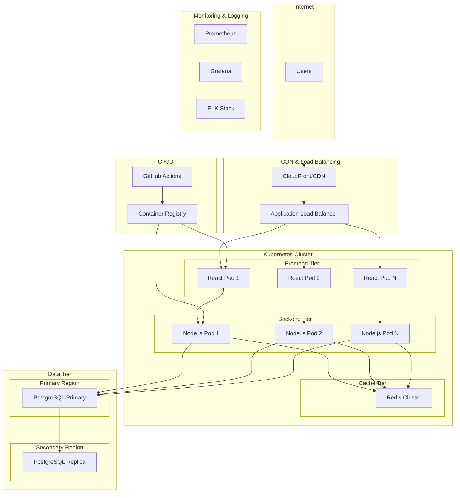
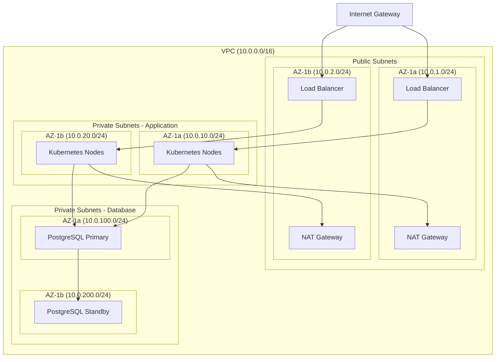

# Cloud Infrastructure Migration Design

## Overview

This design transforms DhakaCart from a single-machine Docker Compose setup into a resilient, scalable cloud-native architecture. The system will leverage Kubernetes for container orchestration, implement comprehensive monitoring and logging, establish automated CI/CD pipelines, and ensure security and disaster recovery capabilities.

### Current State Analysis
- **Frontend**: React application (port 3000)
- **Backend**: Node.js/Express API with rate limiting (port 5000)
- **Database**: PostgreSQL with basic schema (products table)
- **Cache**: Redis for session/data caching
- **Deployment**: Single-machine Docker Compose

### Target State
- **Multi-region cloud deployment** with auto-scaling
- **Kubernetes orchestration** with health checks and rolling updates
- **Load balancing** across multiple instances
- **Automated CI/CD** with zero-downtime deployments
- **Comprehensive monitoring** and centralized logging
- **Infrastructure as Code** for reproducible deployments

## Architecture

### High-Level Architecture



### Network Architecture



## Components and Interfaces

### 1. Container Images

#### Frontend Container (React)
- **Base Image**: nginx:alpine
- **Build Process**: Multi-stage build with Node.js for compilation
- **Configuration**: Environment-based API endpoints
- **Health Check**: HTTP GET /health endpoint
- **Resource Limits**: 256Mi memory, 0.1 CPU

#### Backend Container (Node.js)
- **Base Image**: node:18-alpine
- **Dependencies**: Express, pg, redis, rate-limiting middleware
- **Configuration**: Environment variables for database and Redis connections
- **Health Check**: GET /health with database connectivity test
- **Resource Limits**: 512Mi memory, 0.5 CPU

#### Database (PostgreSQL)
- **Managed Service**: AWS RDS PostgreSQL 15
- **Configuration**: Multi-AZ deployment with read replicas
- **Backup**: Automated daily backups with 30-day retention
- **Monitoring**: CloudWatch metrics and Performance Insights

#### Cache (Redis)
- **Managed Service**: AWS ElastiCache Redis Cluster
- **Configuration**: Multi-node cluster with automatic failover
- **Persistence**: AOF and RDB snapshots
- **Monitoring**: CloudWatch metrics

### 2. Kubernetes Resources

#### Deployments
```yaml
# Frontend Deployment
apiVersion: apps/v1
kind: Deployment
metadata:
  name: dhakacart-frontend
spec:
  replicas: 3
  strategy:
    type: RollingUpdate
    rollingUpdate:
      maxSurge: 1
      maxUnavailable: 0
  template:
    spec:
      containers:
      - name: frontend
        image: dhakacart/frontend:latest
        resources:
          requests:
            memory: "128Mi"
            cpu: "0.1"
          limits:
            memory: "256Mi"
            cpu: "0.2"
        livenessProbe:
          httpGet:
            path: /health
            port: 80
          initialDelaySeconds: 30
          periodSeconds: 10
        readinessProbe:
          httpGet:
            path: /health
            port: 80
          initialDelaySeconds: 5
          periodSeconds: 5
```

#### Services
- **Frontend Service**: ClusterIP with ingress controller
- **Backend Service**: ClusterIP with internal load balancing
- **Database Service**: External service pointing to RDS endpoint

#### Horizontal Pod Autoscaler (HPA)
```yaml
apiVersion: autoscaling/v2
kind: HorizontalPodAutoscaler
metadata:
  name: dhakacart-backend-hpa
spec:
  scaleTargetRef:
    apiVersion: apps/v1
    kind: Deployment
    name: dhakacart-backend
  minReplicas: 3
  maxReplicas: 50
  metrics:
  - type: Resource
    resource:
      name: cpu
      target:
        type: Utilization
        averageUtilization: 70
  - type: Resource
    resource:
      name: memory
      target:
        type: Utilization
        averageUtilization: 80
```

### 3. Load Balancing and Ingress

#### Application Load Balancer (ALB)
- **SSL Termination**: AWS Certificate Manager certificates
- **Health Checks**: HTTP health endpoints with 30-second intervals
- **Sticky Sessions**: Cookie-based session affinity for frontend
- **Security Groups**: Restricted to HTTPS (443) and HTTP (80)

#### Ingress Controller
- **Implementation**: AWS Load Balancer Controller
- **Features**: Path-based routing, SSL redirect, rate limiting
- **Annotations**: Auto-scaling, health checks, security policies

## Data Models

### Database Schema Evolution

#### Current Schema
```sql
CREATE TABLE products (
  id SERIAL PRIMARY KEY,
  name TEXT NOT NULL,
  price NUMERIC NOT NULL,
  created_at TIMESTAMP DEFAULT CURRENT_TIMESTAMP
);
```

#### Enhanced Schema for Cloud
```sql
-- Products table with additional fields for e-commerce
CREATE TABLE products (
  id SERIAL PRIMARY KEY,
  name TEXT NOT NULL,
  description TEXT,
  price NUMERIC(10,2) NOT NULL,
  stock_quantity INTEGER DEFAULT 0,
  category_id INTEGER REFERENCES categories(id),
  image_url TEXT,
  is_active BOOLEAN DEFAULT true,
  created_at TIMESTAMP DEFAULT CURRENT_TIMESTAMP,
  updated_at TIMESTAMP DEFAULT CURRENT_TIMESTAMP
);

-- Categories for product organization
CREATE TABLE categories (
  id SERIAL PRIMARY KEY,
  name TEXT NOT NULL UNIQUE,
  description TEXT,
  created_at TIMESTAMP DEFAULT CURRENT_TIMESTAMP
);

-- Users for authentication and orders
CREATE TABLE users (
  id SERIAL PRIMARY KEY,
  email TEXT NOT NULL UNIQUE,
  password_hash TEXT NOT NULL,
  first_name TEXT,
  last_name TEXT,
  phone TEXT,
  created_at TIMESTAMP DEFAULT CURRENT_TIMESTAMP,
  updated_at TIMESTAMP DEFAULT CURRENT_TIMESTAMP
);

-- Orders for transaction tracking
CREATE TABLE orders (
  id SERIAL PRIMARY KEY,
  user_id INTEGER REFERENCES users(id),
  total_amount NUMERIC(10,2) NOT NULL,
  status TEXT DEFAULT 'pending',
  shipping_address JSONB,
  created_at TIMESTAMP DEFAULT CURRENT_TIMESTAMP,
  updated_at TIMESTAMP DEFAULT CURRENT_TIMESTAMP
);

-- Order items for detailed order tracking
CREATE TABLE order_items (
  id SERIAL PRIMARY KEY,
  order_id INTEGER REFERENCES orders(id),
  product_id INTEGER REFERENCES products(id),
  quantity INTEGER NOT NULL,
  unit_price NUMERIC(10,2) NOT NULL,
  created_at TIMESTAMP DEFAULT CURRENT_TIMESTAMP
);

-- Indexes for performance
CREATE INDEX idx_products_category ON products(category_id);
CREATE INDEX idx_products_active ON products(is_active);
CREATE INDEX idx_orders_user ON orders(user_id);
CREATE INDEX idx_orders_status ON orders(status);
CREATE INDEX idx_order_items_order ON order_items(order_id);
```

### Cache Data Models

#### Redis Key Patterns
```javascript
// Session data
`session:${sessionId}` -> { userId, cartItems, expiresAt }

// Product cache
`product:${productId}` -> { id, name, price, stock, ... }

// Category cache
`category:${categoryId}` -> { id, name, products[] }

// User cart
`cart:${userId}` -> { items: [{ productId, quantity }], total }

// Rate limiting
`rate_limit:${ip}:${endpoint}` -> { count, resetTime }
```

## Error Handling

### Application-Level Error Handling

#### Backend Error Middleware
```javascript
// Global error handler
app.use((err, req, res, next) => {
  const errorId = generateErrorId();
  
  // Log error with correlation ID
  logger.error({
    errorId,
    message: err.message,
    stack: err.stack,
    url: req.url,
    method: req.method,
    userId: req.user?.id,
    timestamp: new Date().toISOString()
  });
  
  // Return sanitized error response
  res.status(err.status || 500).json({
    error: {
      id: errorId,
      message: process.env.NODE_ENV === 'production' 
        ? 'Internal server error' 
        : err.message,
      timestamp: new Date().toISOString()
    }
  });
});
```

#### Database Connection Resilience
```javascript
// Connection pool with retry logic
const pool = new Pool({
  host: process.env.DB_HOST,
  user: process.env.DB_USER,
  password: process.env.DB_PASSWORD,
  database: process.env.DB_NAME,
  port: process.env.DB_PORT,
  max: 20,
  idleTimeoutMillis: 30000,
  connectionTimeoutMillis: 2000,
  maxUses: 7500,
});

// Query with retry logic
async function queryWithRetry(query, params, maxRetries = 3) {
  for (let attempt = 1; attempt <= maxRetries; attempt++) {
    try {
      return await pool.query(query, params);
    } catch (error) {
      if (attempt === maxRetries) throw error;
      
      // Exponential backoff
      await new Promise(resolve => 
        setTimeout(resolve, Math.pow(2, attempt) * 1000)
      );
    }
  }
}
```

### Infrastructure-Level Error Handling

#### Kubernetes Liveness and Readiness Probes
- **Liveness Probe**: Restarts containers that become unresponsive
- **Readiness Probe**: Removes unhealthy pods from service endpoints
- **Startup Probe**: Handles slow-starting containers

#### Circuit Breaker Pattern
```javascript
// Circuit breaker for external services
class CircuitBreaker {
  constructor(threshold = 5, timeout = 60000) {
    this.failureThreshold = threshold;
    this.timeout = timeout;
    this.failureCount = 0;
    this.state = 'CLOSED'; // CLOSED, OPEN, HALF_OPEN
    this.nextAttempt = Date.now();
  }
  
  async call(fn) {
    if (this.state === 'OPEN') {
      if (Date.now() < this.nextAttempt) {
        throw new Error('Circuit breaker is OPEN');
      }
      this.state = 'HALF_OPEN';
    }
    
    try {
      const result = await fn();
      this.onSuccess();
      return result;
    } catch (error) {
      this.onFailure();
      throw error;
    }
  }
}
```

## Testing Strategy

### 1. Unit Testing
- **Framework**: Jest for backend, React Testing Library for frontend
- **Coverage**: Minimum 80% code coverage
- **Scope**: Individual functions, components, and modules
- **Automation**: Run on every commit via GitHub Actions

### 2. Integration Testing
- **Database Testing**: Test database operations with test containers
- **API Testing**: End-to-end API testing with supertest
- **Cache Testing**: Redis integration testing
- **Scope**: Component interactions and data flow

### 3. Contract Testing
- **API Contracts**: OpenAPI specification validation
- **Database Contracts**: Schema migration testing
- **Service Contracts**: Interface compatibility testing

### 4. Performance Testing
- **Load Testing**: Artillery.js for API load testing
- **Stress Testing**: Kubernetes resource limit testing
- **Scalability Testing**: Auto-scaling behavior validation
- **Targets**: 100,000 concurrent users, <2s response time

### 5. Security Testing
- **Vulnerability Scanning**: Snyk for dependency scanning
- **Container Scanning**: Trivy for container image scanning
- **Penetration Testing**: OWASP ZAP for web application security
- **Compliance**: Regular security audits and compliance checks

### 6. Chaos Engineering
- **Pod Failures**: Random pod termination testing
- **Network Partitions**: Network connectivity failure simulation
- **Resource Exhaustion**: CPU and memory limit testing
- **Database Failures**: Primary database failover testing

### 7. Monitoring and Observability Testing
- **Metrics Validation**: Prometheus metrics accuracy testing
- **Alert Testing**: Alert rule validation and notification testing
- **Log Aggregation**: Log parsing and search functionality testing
- **Dashboard Testing**: Grafana dashboard functionality validation

## Implementation Phases

### Phase 1: Foundation (Weeks 1-2)
- Set up cloud infrastructure with Terraform
- Create Kubernetes cluster with basic networking
- Implement container registry and basic CI/CD pipeline
- Deploy monitoring and logging infrastructure

### Phase 2: Application Migration (Weeks 3-4)
- Containerize and deploy frontend and backend applications
- Set up managed database and cache services
- Implement load balancing and ingress
- Configure auto-scaling and health checks

### Phase 3: Security and Compliance (Weeks 5-6)
- Implement secrets management and RBAC
- Set up SSL/TLS and network security
- Configure backup and disaster recovery
- Implement security scanning and compliance monitoring

### Phase 4: Optimization and Testing (Weeks 7-8)
- Performance testing and optimization
- Chaos engineering and resilience testing
- Documentation and runbook creation
- Final security audit and compliance validation